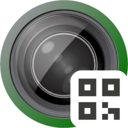

<h1>Quick Camera +QR</h1>

  
<h4>Simple, lightweight, just works</h4>

## TOC

<!-- toc -->

- [Download & Installation](#download--installation)
- [About](#about)
- [Motivation](#motivation)
- [Objective](#objective)

<!-- tocstop -->

## Download & Installation

You can grab the latest binary from the link below. Please follow the instructions on the page for the Installation.  
[Download v0.0.1](https://github.com/takamasa1999/quick-camera-plus-qr/releases/tag/v0.0.1)

**Note:** This app is in active development — expect bugs, crashes, and unfinished features.

## About

This is a fork from [Quick Camera](https://github.com/simonguest/quick-camera). Thanks to the author for making such an efficient, reliable camera utility.  
We plan to add QR code reading functionality by utilizing [Zbar](https://github.com/mchehab/zbar?utm_source=chatgpt.com) as the backend.

## Motivation

It seems like currently there's no FOSS lightweight QR code reader for macOS. I use QR codes day-to-day for passing Wi-Fi passwords, web links, draft sentences, etc., between various devices, since they're minimal and just work in any environment.  
I've been using Quick Camera because it's lightweight and reliable. In addition, it's a divine FOSS. One thing that I'd been missing from the software is the QR code reading functionality.  
For a while, I was waiting around for someone else to update the app. But then I remembered… hey, I code. And my cousin’s a macOS dev, too. So why not just build it ourselves?

## Objective

The goal for this app development is pretty simple. **Just adding QR code reading functionality to the upstream**.
Keeping it simple, separation of concerns.  
Optimally, bringing the same lightweight and efficient experience as the upstream provides.
